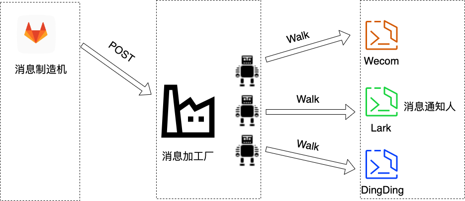

# Papillon
## Overview



This is a webhook parser between gitlab and other IM (Intra-Message).

This currently only supports merge request,tag,release from gitlab and send it to wecom. 
But you can add other terminal logic in robot_type dir, or contact us for supporting more terminal.

Papillon is high extensible. 

## How to deploy
```
1. local machine
2. docker container
```
## local machine 
you can use cli to launch papillon at local

### Configuration
``` bash
$ cp ./example-backend.yaml /path/backend.yaml
$ ./main.o -c /path/backend.yaml
```

## Docker
### Install Docker Compose v2
https://docs.docker.com/compose/cli-command/#install-on-linux

### Configuration
Make a new configuration file
``` bash
$ cp example-api.env api.env
$ vi api.env
```

在这个文件中，你会看到两个变量：`LISTEN` and `BOTADDR`

#### LISTEN
输入一个你在 ACL 工单中提出的可以与 gitlab 互通的端口

#### BOTADDR
1. 创建一个企业微信机器人并获取其 webhook 地址
2. 将该地址放入 api.env 中

### Start the container
``` bash
$ docker compose up -d
$ docker exec gitrabbit-web-1 go build
$ docker exec gitrabbit-web-1 go run gitrabbit
```
不知道为什么 Dockerfile 里面写好的命令不会执行，有没有大神知道。这样就能去掉 exec 这两行了

## Gitlab related
你必须拥有一个项目的 maintainer 权限才能添加 webhook 和 private access token。详见：https://docs.gitlab.com/ee/user/project/integrations/webhooks.html

将 webhook 的地址设为 “http://yourIP:LISTEN/gitlab", 勾选 Merge Request/Tag/Release，并关闭 SSL

## Congrats
The bot should be working!
